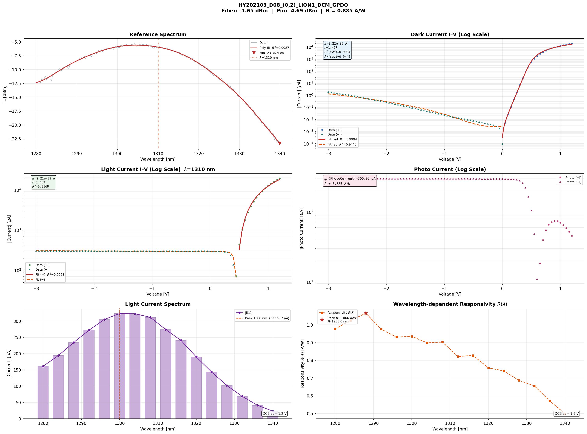
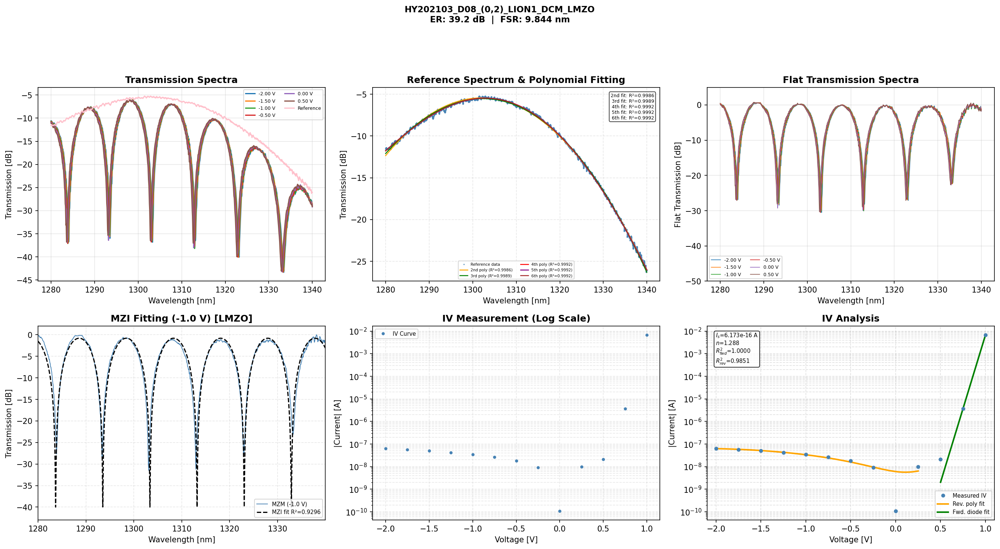
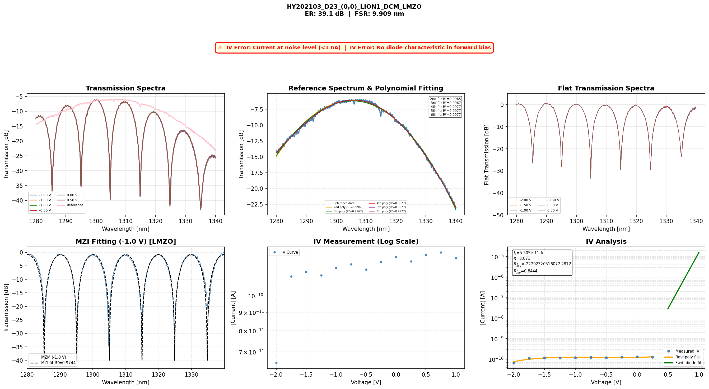
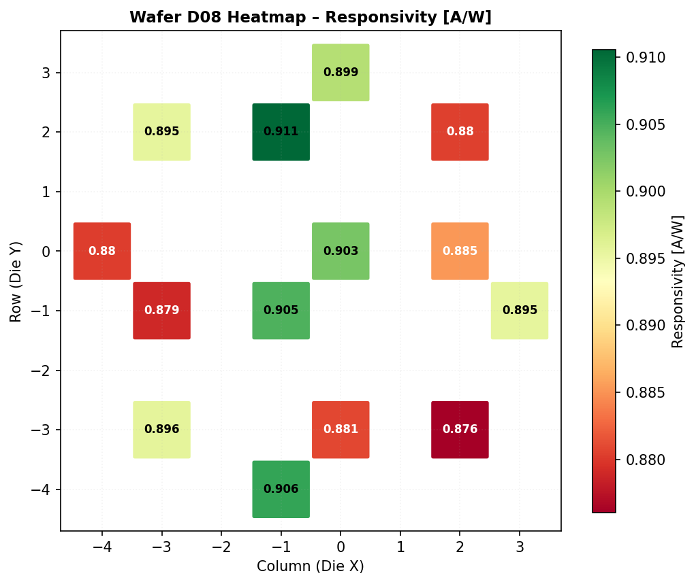
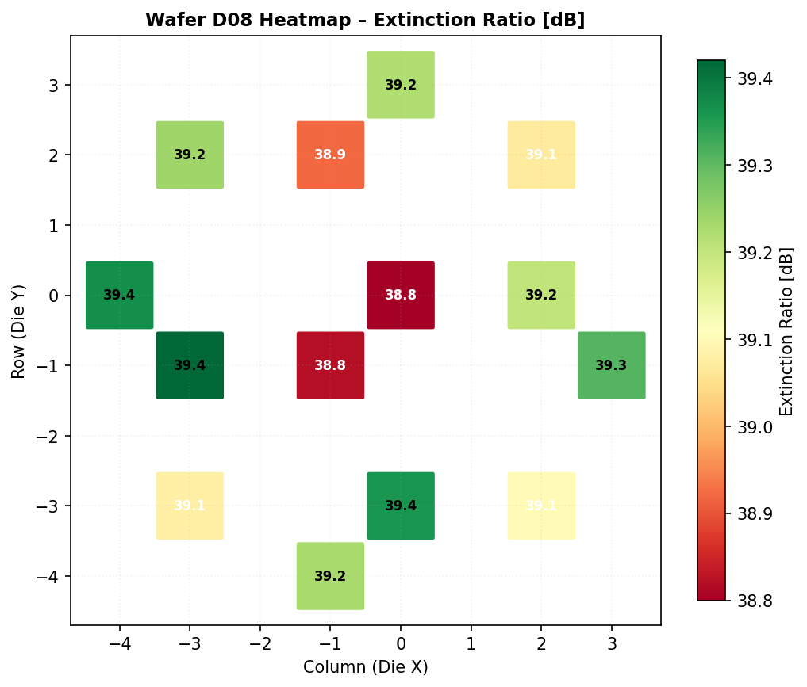
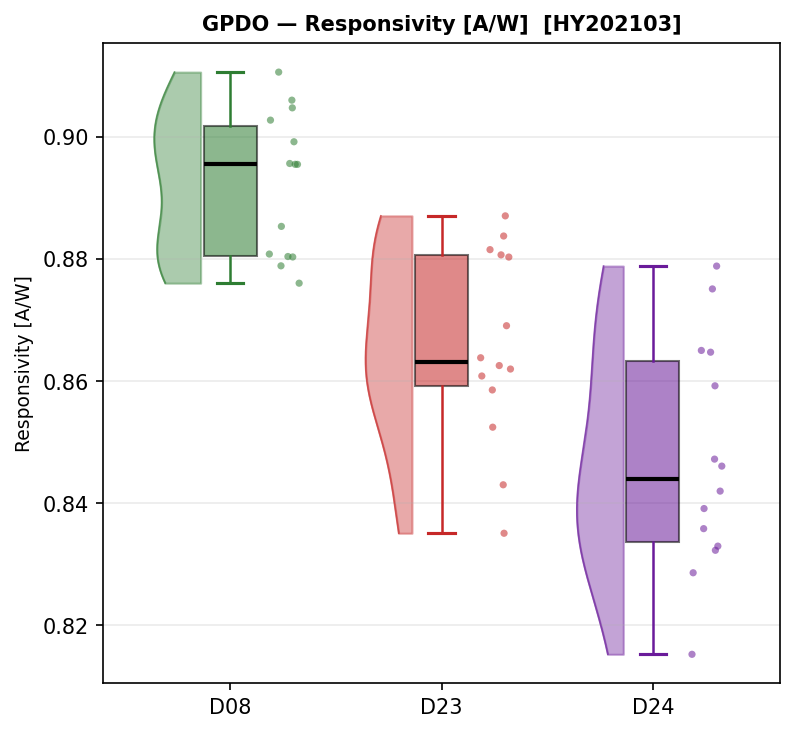
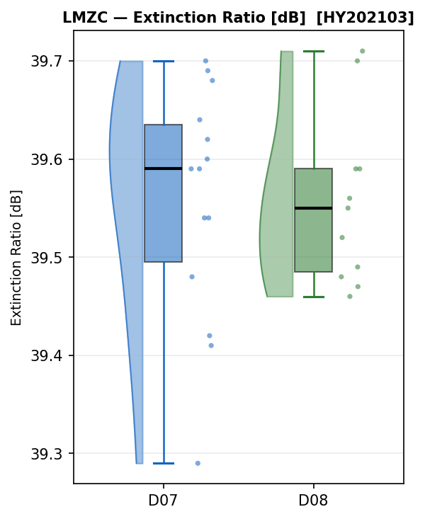

# 🔬 Silicon Photonics Wafer Analyzer

> An automated analysis pipeline that parses, fits, and visualizes XML measurement data from semiconductor wafer optical devices (GPDO / MZM).


---

## 1. The Problem We Solve

In silicon photonics fabrication, a single wafer holds dozens of optical device dies, and each die produces its own XML measurement file. Manually opening these files, plotting graphs, and extracting parameters is **time-consuming and error-prone.**

This project automates the entire workflow — parsing → fitting → visualization → CSV export — with **a single command.** It targets two device types:

| Device | Type | Key Parameters |
|--------|------|----------------|
| **GPDO** | Germanium Photodetector | Photocurrent Iph, ideality factor n, responsivity R, peak wavelength |
| **MZM** | Mach-Zehnder Modulator (LMZC / LMZO) | Extinction ratio ER, FSR, I–V characteristics |

---

## 2. Project Structure

From one input XML to PNG/CSV output, each module owns **a single responsibility.**

```
Input XML  →  Parser  →  Fitting  →  Analyzer  →  ┬─→  Plotter   (per-die PNG)
             (parse)     (fit/calc)  (orchestrate) ├─→  Heatmap   (wafer heatmap)
                                                   └─→  CSV       (parameter table)
```

```
project/
├── run.py                    # Entry point — select device via CLI args
├── config.py                 # Path / wafer / device settings (DEVICE_CONFIG)
├── Jupyter Notebook.ipynb    # Notebook for execution & result review
├── requirements.txt          # Pinned dependency versions
│
├── data/                     # Raw XML measurement data (Git-ignored — see §4)
├── res/                      # Analysis output PNG/CSV (Git-ignored, generated at runtime)
│
└── src/
    ├── gpdo/                 # GPDO device package
    │   ├── parser.py         #   GPDOParser — XML parsing
    │   ├── fitting.py        #   FittingEngine — Shockley / power-law fitting
    │   ├── plotter.py        #   Plotter — per-die multi-panel PNG
    │   ├── csv.py            #   CSV export
    │   └── analyzer.py       #   GPDOAnalyzer — full pipeline integration
    ├── mzm/                  # MZM device package (LMZC / LMZO)
    │   ├── parser.py         #   MZMParser — XML parsing + device-type detection
    │   ├── fitting.py        #   fit_mzi / process_iv — MZI ER·FSR extraction
    │   ├── plotter.py        #   Plotter — per-die multi-panel PNG
    │   ├── csv.py            #   CSV export
    │   └── analyzer.py       #   MZMAnalyzer — full pipeline integration
    ├── heatmap_plotter.py    # HeatmapPlotter — shared wafer heatmap
    └── boxplot.py            # Shared statistical Raincloud boxplot
```

### Module Responsibilities

| Module | Responsibility | Design Intent |
|--------|----------------|---------------|
| **Parser** | XML → raw-data dict | Handles *parsing only*, even when XML structure differs per device |
| **Fitting** | Physical-model fitting & parameter computation | Separated from parsing → reusable even if measurement format changes |
| **Analyzer** | Folder traversal, quality check, stage calls | Integrates the full workflow |
| **Plotter / Heatmap / Boxplot** | Result visualization | Decoupled from analysis logic → graph format changes independently |
| **CSV** | Parameter-table output | Produces the final deliverable |

> **Design principle:** When a new device is added, only its *parsing rules and fitting model* need defining; the shared flow (folder traversal, visualization, CSV) is reused as-is. We proved this by starting with GPDO and extending to MZM (LMZC · LMZO).

---

## 3. Analysis Models

### GPDO — Parameter Extraction

**(1) Ideality Factor `n` · Saturation Current `Is`**

Extracted by fitting the **Shockley diode equation** to forward-bias IV data (V > 0.3 V):

```
I = Is · exp(V / n·Vt)

  Vt = kT/q ≈ 0.02585 V  (thermal voltage at 300 K)
  Is : reverse saturation current  [A]
  n  : ideality factor  (ideal diode = 1, recombination-dominant = 2)
```

`Is` and `n` are determined via `scipy.optimize.curve_fit`. The reverse region (V ≤ 0.3 V) is fit separately with a 3rd-order polynomial to characterize leakage.

**(2) Photocurrent `Iph` · Responsivity `R`**

```
I_photo(V) = I_light(V) − I_dark(V)
Iph        = I_photo at measurement bias (typically −1 V)

P_in [W]   = 10^((fiber_dBm + IL_ref(λ) / 2 − 30) / 10)
R [A/W]    = Iph / P_in
```

`I_photo` is the element-wise difference of the light/dark sweeps. `P_in` is back-calculated from the fiber output power and the reference spectrum insertion loss at the measurement wavelength.

> **Note on the photocurrent graph shape:** Because `I_light` and `I_dark` have different zero-crossing points on the IV curve, `I_photo = I_light − I_dark` briefly changes sign near the flat region. Applying the absolute value produces an abrupt V-shaped dip at that point. This is **expected behavior**, not a measurement error.

---

### MZM — Parameter Extraction

**(3) Extinction Ratio `ER` · Free Spectral Range `FSR`**

Extracted by fitting a **fixed −40 dB floor MZI transmission model**:

```
T(λ) = c + d · cos(a·λ + b)

  floor  = 10^(−40/10) = 1×10⁻⁴   (fixed — avoids local minima)
  c      = (t_max + floor) / 2
  d      = (t_max - floor) / 2

Free parameters:
  a      → FSR = 2π / a  [nm]
  b      → phase offset
  t_max  → peak normalized transmission

ER [dB] = 10 · log10(t_max / floor)
```

Fixing the floor reduces free parameters from 4 to 3, preventing unphysical solutions. The FSR initial guess is derived from transmission-dip spacings detected by `scipy.signal.argrelmin`.

**(4) MZM I–V Parameters**

Same Shockley fitting as GPDO. `I at −1V` is read directly from the measured IV sweep at V = −1 V.

---

### Measurement-Data Quality Check

We initially assumed all data was valid, but found cases where the **ideality factor exceeded 3** (physically unreasonable for a silicon diode). Tracing back revealed two distinct failure modes:

| Error Type | Condition | Root Cause |
|------------|-----------|------------|
| **Noise-level current** | `max(│I│) < 1 nA` | Probe contact failure — no current flows |
| **No diode characteristic** | `I_max / I_min < 10` at V > 0.3V | Junction failure — no exponential forward rise |

When detected:
- Recorded in the CSV `ErrorFlag` / `Error description` columns
- A **`⚠ Measurement Data Error`** banner is overlaid in the PNG title area
- The die is **excluded from wafer-level statistics** (heatmap, boxplot)

Both error types are independently flagged so they can be distinguished in the output.

---

## 4. Screenshots

### GPDO — Per-Die 6-Panel Analysis Graph
> Reference Spectrum · Dark/Light IV · Photo Current · Spectrum · Responsivity R(λ)



---

### MZM — Per-Die 6-Panel Analysis Graph
> Transmission Spectra · Ref Fitting · Flat Spectra · MZI Fitting · IV Measurement · IV Analysis



---

### Measurement Data Error Detection
> When IV data is abnormal, a warning banner is overlaid in the title area — the 6 analysis panels remain fully visible.



---

### Wafer Heatmaps — GPDO Responsivity / MZM Extinction Ratio

| GPDO — Responsivity [A/W] | MZM — Extinction Ratio [dB] |
|:---:|:---:|
|  |  |

---

### Raincloud Boxplots — Cross-Wafer Statistical Comparison
> KDE density (left) + Boxplot (center) per wafer — error-flagged dies excluded

| GPDO — Responsivity [A/W] | MZM (LMZC) — Extinction Ratio [dB] |
|:---:|:---:|
|  |  |

---

## 5. How to Run — Reproducibility Guide

### 5-1. Installation

```bash
git clone https://github.com/H1SKIM/Teamproject-GPDO-.git
cd "Teamproject-GPDO-"
pip install -r requirements.txt
```

> If `requirements.txt` is unavailable: `pip install numpy scipy matplotlib pandas lxml`

### 5-2. Place Measurement Data

XML files are not tracked in Git. Place the **HY202103 dataset** as follows:

```
data/
└── HY202103/                       ← Project folder (auto-detected)
    ├── D07/
    │   └── 20190715_190855/
    │       ├── HY202103_D07_(0,0)_LION1_DCM_LMZC.xml
    │       └── ...
    ├── D08/
    │   └── 20190526_082853/
    │       ├── HY202103_D08_(0,0)_LION1_DCM_GPDO.xml
    │       ├── HY202103_D08_(0,0)_LION1_DCM_LMZO.xml
    │       └── ...
    ├── D23/
    └── D24/
```

> The folder structure (`project → wafer ID → timestamp`) is **auto-detected**. No `config.py` edits required — just place the folders.

### 5-3. Execution — Two Ways

**Option A. CLI**

```bash
python run.py            # All devices (GPDO + MZM)
python run.py GPDO       # GPDO only
python run.py MZM        # MZM only (includes LMZC + LMZO)
```

**Option B. Jupyter Notebook** *(presentation demo)*

Open `Jupyter Notebook.ipynb` and run cells in order to walk through parsing, fitting, graphs, heatmaps, and CSV export **directly inside the notebook.**

### 5-4. Verify a Successful Run

```
============================================================
  📋 Run Summary
============================================================
  ✅ GPDO  / D08  →  res/png/GPDO/HY202103/D08/{timestamp}/
  ✅ GPDO  / D23  →  res/png/GPDO/HY202103/D23/{timestamp}/
  ✅ MZM   / D07  →  res/png/MZM/HY202103/D07/{timestamp}/
  ✅ MZM   / D08  →  res/png/MZM/HY202103/D08/{timestamp}/
============================================================
```

- Per-die PNG graphs and `heatmap/` → `res/png/<device>/...`
- Per-wafer CSVs and `Total_Result.csv` → `res/csv/<device>/...`
- Raincloud boxplots → `res/png/boxplot/<project>/`

---

## 6. What the Results Mean

| Output | Meaning |
|--------|---------|
| **Per-die 6-panel PNG** | I–V, spectrum, and responsivity of one die at a glance — device-level quality judgment |
| **Wafer heatmap** | Parameter distribution by die position → reveals process uniformity / anomalous regions |
| **Raincloud boxplot** | Compares parameter distributions across wafers (KDE density + boxplot) |
| **Total CSV** | Aggregated parameters for all dies — input for downstream statistical analysis |

> Example: if only edge dies show low responsivity in the GPDO heatmap, it suggests process variation at the wafer edge. Dies with abnormally high ideality factors are automatically separated by the quality check, preventing statistical distortion.

---

## 7. Output CSV Columns

### GPDO

| Column | Unit | Description |
|--------|------|-------------|
| `wafer_id` | — | Wafer identifier |
| `col` / `row` | — | Die position (X / Y) |
| `lc_wl` | nm | Light current measurement wavelength |
| `fiber_dbm` | dBm | Fiber output power |
| `Iph` | A | Photo current |
| `n_d` | — | Ideality factor |
| `R_resp` | A/W | Responsivity |
| `r2_fwd` | — | Forward bias fitting R² |

### MZM

| Column | Unit | Description |
|--------|------|-------------|
| `Lot` / `Wafer` / `Mask` / `Testsite` | — | Wafer identification info |
| `col` / `row` | — | Die position |
| `Analysis Wavelength` | nm | Analysis wavelength |
| `Rsq of Ref. spectrum (Nth)` | — | Reference spectrum fitting R² |
| `Rsq of IV` | — | IV fitting R² |
| `I at -1V [A]` / `I at 1V [A]` | A | Current at each voltage |
| `Ideality Factor` | — | Diode ideality factor |
| `Extinction Ratio (dB)` | dB | MZI extinction ratio |
| `FSR (nm)` | nm | Free Spectral Range |
| `ErrorFlag` / `Error description` | — | Data quality flag |

---

## 8. Configuration

### Adding a New Project or Wafer

Simply add a folder under `data/` — it will be **auto-detected**. No `config.py` edits required.

```
data/
├── HY202103/   ← existing
└── HY202104/   ← auto-processed by adding folder only
    └── D07/ ...
```

### Restricting to Specific Wafers

```python
# config.py
DEVICE_CONFIG = {
    "GPDO": dict(wafer_ids=["D08", "D24"]),  # D08 and D24 only
    "MZM":  dict(wafer_ids=None),            # None → all wafers
}
```

---

## 9. Team Roles

| Member | Responsibility | Presentation |
|--------|----------------|--------------|
| **Team Lead** | Problem definition · project structure · module design | §1–2 |
| **Member 1** | Parsing/fitting algorithms · quality-check implementation | §3 |
| **Member 2** | Notebook execution · result visualization · interpretation | §5–6 |

---

## Environment

- Python 3.10 or higher
- `numpy` `scipy` `matplotlib` `pandas` `lxml`

**Project Link:** [https://github.com/H1SKIM/Teamproject-GPDO-](https://github.com/H1SKIM/Teamproject-GPDO-)
